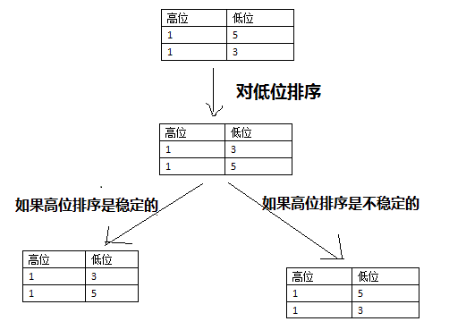

[TOC level=1-4]: # " "

- [排序算法](#排序算法)
    - [1. 排序的定义](#1-排序的定义)
        - [1.1. 排序的分类](#11-排序的分类)
            - [1.1.1. 是否消耗额外的空间](#111-是否消耗额外的空间)
            - [1.1.2. 稳定性](#112-稳定性)
    - [2. 排序算法](#2-排序算法)
        - [2.1. 插入排序](#21-插入排序)

# 排序算法

算法 ：9世纪波斯数学家提出的“al-Khowarizmi”

## 1. 排序的定义

输入：n个数（a1,a2,a3...an)
输出：n个数的排列（a1',a2',a3'...an')，使得a1'<=a2'<=a3'<=...<=an'

主要的排序算法有八种：直接插入排序，希尔排序（这两种统称为插入排序），冒泡排序，快速排序（这两种统称为交换排序），直接选择排序，堆排序（这两种统称为选择排序），归并排序，基数排序。

### 1.1. 排序的分类

#### 1.1.1. 是否消耗额外的空间

##### 1.1.1.1.  In-place sort
不占用额外内存或占用常数的内存)

1. 插入排序
2. 选择排序
3. 冒泡排序
4. 堆排序
5. 快速排序

##### 1.1.1.2. Out-place sort

1. 归并排序
2. 计数排序
3. 基数排序
4. 桶排序

当需要对大量数据进行排序时，In-place sort就显示出优点，因为只需要占用常数的内存，更加可控。
#### 1.1.2. 稳定性

**什么是算法稳定性？**

假定在待排序的记录序列中，存在多个具有相同的关键字的记录，若经过排序，这些记录的相对次序保持不变，即在原序列中，ri=rj，且ri在rj之前，而在排序后的序列中，ri仍在rj之前，则称这种排序算法是稳定的；否则称为不稳定的。

**算法稳定性的重要性**

算法稳定性为什么这么重要呢？

1. 在实际的应用中，我们交换的不一定只是一个整数，而可能是一个很大的对象，交换元素存在一定的开销；

2. 参照基数排序，不稳定排序是无法完成基数排序的。
   

##### 1.1.2.1. stable sort

1. 插入排序
2. 冒泡排序
3. 归并排序
4. 计数排序
5. 基数排序
6. 桶排序

##### 1.1.2.2. unstable sort

1. 选择排序
2. 快速排序
3. 堆排序

算法的不稳定性会

## 2. 排序算法

### 2.1. 插入排序

[^参考1:]: http://blog.csdn.net/xiazdong/article/details/8462393
[^参考2:]: http://www.cnblogs.com/lqminn/p/3642027.html
