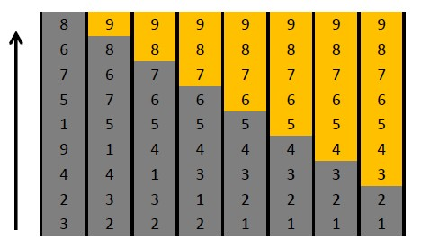

[TOC levels=1-4]: # " "

- [冒泡排序（Insertion Sort）](#冒泡排序insertion-sort)
    - [一、算法思想](#一算法思想)
    - [二、算法示意图](#二算法示意图)
    - [三、Java 代码](#三java-代码)
    - [四、算法复杂度](#四算法复杂度)


# 冒泡排序（Bubble Sort）

## 一、算法思想

冒泡排序是排序算法中比较有意思的一种排序方法，也很简单。其算法思想如下：

1. 比较相邻的元素。如果第一个比第二个大，就交换他们两个。

2. 对每一对相邻元素作同样的工作，从开始第一对到结尾的最后一对。在这一点，最后的元素应该会是最大的数。

3. 针对所有的元素重复以上的步骤，除了最后一个。

4. 持续每次对越来越少的元素重复上面的步骤，直到没有任何一对数字需要比较。


## 二、算法示意图




这幅图形象的展示了冒泡的过程，最左边一列，从下往上显示了等待排序的数列，最后一列则显示了冒泡排序的最终结果。每一列阴影的部分代表等待排序的数列，黄色部分表示排序完成的部分，冒泡过程中不需要涉及黄色部分，我们解释一下第二列的形成过程：

第二列在冒泡过程中（从下往上看），首先比较2和3，2<3，则交换；比较3和4，4>3，不需要交换；比较4和9，9>4，不需要交换，比较1和9，1<9，交换；比较5和9，5<9，交换；比较7和9，7<9，交换；比较6和9，6<9，交换；比较8和9，8<9，交换。这样就形成了第二列。第二列形成以后，9，也就是最后的数字已经是最大的了，第二趟这样进行形成第三列的时候，就不需要进行到9了。

每一趟冒泡，都是将灰色数列部分中最大的数字选择出来放到黄色部分的最下层，由此形成下一列，最大数字的选择是通过数字的交换来完成的——算法会从数列的最前端开始往后遍历，如果发现某一个数比它前面的数字小，就会进行交换，把较大的数字往后移动。由此不断进行，就可以将最大的数字移动到数列灰色部分的最后。


## 三、Java 代码
```java
//@wiki
public class BubbleSort extends Sort {
    public static void sort(int[] array) {
        int temp = 0;
        for (int i = array.length - 1; i > 0; --i) {
            for (int j = 0; j < i; ++j) {
                if (array[j + 1] < array[j]) {
                    temp = array[j];
                    array[j] = array[j + 1];
                    array[j + 1] = temp;
                }
            }
        }
    }
}
```
### 优化算法

```java
public class BubbleSort extends Sort {
    public static void sort(int[] array) {
        int temp = 0;
        for (int i = array.length - 1; i > 0; --i) {
            boolean exchange = false;
            for (int j = 0; j < i; ++j) {
                if (array[j + 1] < array[j]) {
                    exchange = true;
                    temp = array[j];
                    array[j] = array[j + 1];
                    array[j + 1] = temp;
                }
            }
            if(!exchange)
                return;
        }
    }
}
```


## 四、算法复杂度

从上面的Java代码来看，第7行的比较是一定会进行的，假设数组元素是n，则进行的次数是：n*(n-1)/2。因为j是从0~i-1，而i是从n-1~1，所以简单计算就可以得出以上的结果。

最差的情况当然是每次都执行if条件判断，并且执行其中的8,9,10三行语句，整体复杂度为4*n^2。出现最坏的情况就是一开始数列是倒叙排列的，即按照从大到小的顺序排列的，导致每一次比较都需要交换。

在本代码中，最好的情况其实不能达到，我们去看示意图，我们发现五列已经完成了排序，第6,7,8列的排序过程其实可以省略。所以，冒泡排序可以优化，我们增加一个flag，当一趟冒泡完成时我们发现没有发生交换行为，就可以终止冒泡了

如上，这样，我们可以将最好的复杂度降低为n，情况出现在数列一开始就是从小到大排列的时候，只需要遍历一边，exchange始终为false，直接返回，这样就可以得到最好的时间复杂度，为O(n)，因此平均时间复杂度为O(n^2)。

  空间复杂度非常容易，由代码可以看出来，只需要一个位置temp用于交换即可，因此是O(1)。