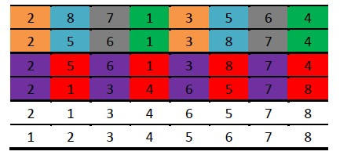

[TOC levels=1-4]: # " "

- [插入排序（Insertion Sort）](#插入排序insertion-sort)
    - [算法思想](#算法思想)


# 希尔排序（Shell Sort）

[http://www.cnblogs.com/lqminn/p/3650033.html](http://www.cnblogs.com/lqminn/p/3650033.html)

## 一、算法思想

希尔排序，也称递减增量排序算法，是插入排序的一种更高效的改进版本。
希尔排序是非稳定排序算法。

希尔排序是基于插入排序的以下两点性质而提出的改进方法的：

1. 插入排序在对已经排好序的数据操作时，效率高，可以达到线性排序的效率。
2. 插入排序一般来说是低效的，因为插入跑徐每次只能将数据移动一位。

我们将数组中的两个元素之间的距离成为Gap，相邻元素之间的Gap自然是1,很明显的，插入排序的算法在调节元素的时候，
Gap是1，折就是在成上面讲的低效的原因。因此希尔排序的思想如下：

1. 假设序列的元素个数是n，选取一个初始Gap的d(d<n)。
2. 讲序列中元素之间的距离（Gap）为d的元素分为一组，在每组之间直接进行插入排序
3. 全部完整之后，缩小Gap到d1(d1<d）然后重复2到Gap为1.

常见的Gap序列如下：

1. 希尔原本的Gap： n/2、 n/4、...1（反复除以2）
2. Hibbard的Gap：1、3、7、...、2k-1（k表示第几个gap）
3. Knuth的Gap: 1、4、13、...、(3k - 1) /2（k表示第几个gap）
4. Sedgewick的Gap: 1、5、19、41、109、...


## 二、算法示意图



如图所示，展示了分组和排序的过程。

第一行是分组的过程，总共有8个元素，Gap为8/2=4，标记为相同颜色的元素为一组。

第二行是同一组元素经过插入排序后形成的样子。可以看到，蓝色和灰色组元素进行了交换。

第三行是Gap缩小为4/2=2的分组，相同颜色元素为一组。

第四行是同组元素经过插入排序后形成的序列，可以看到每一组都是有序的。

第五行是Gap缩小为2/2=1的分组，即整个数列为一个组，直接进行插入排序。
第五行是，序列已经基本有序，靠近插入排序的最优情况，所以插入排序的效率极高。


## 三、Java 代码
```java
public class ShellSort extends Sort {
    public static void sort(int array[]) {
        int length = array.length;
        int temp = 0;
        for (int gap = length / 2; gap >= 1; gap = gap / 2)
            for (int i = gap; i < length; i++)
                for (int j = i; j >= gap && array[j] < array[j - gap]; j -= gap) {
                    temp = array[j];
                    array[j] = array[j - gap];
                    array[j - gap] = temp;
                }
    }
}
```

三层for循环。

第一层进行分组处理（将初始值设置为gap=n/2，递增规则为gap=gap/2）

第二层以gap分组的数组集合进行循环处理（将初始值设置为gap，将最大值设置为n,递增规则为+1，保证每次都会循环都会保证循环到所有的元素）

第三层对每一个元素进行往前进行插入排序，和j-gap作比较进行插入排序


## 四、算法复杂度

其算法复杂度至今没有一个确定的解，其复杂度依赖于其Gap序列，范围Ο(n^1.5) ~ Ο(n^2)。而最好的情况则是序列初始状态就是顺序排列，此时算法的复杂度是O(n)。平均复杂度则为：Ο(n^5/4)。

空间复杂度非常容易，由代码可以看出来，只需要一个位置temp用于交换即可，因此是O(1)。