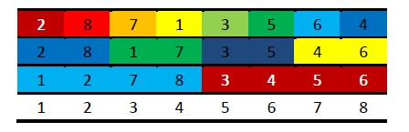

[TOC levels=1-4]: # " "

- [归并排序（Merge Sort）](#归并排序merge-sort)
    - [一、算法思想](#一算法思想)
    - [二、算法示意图](#二算法示意图)
    - [三、Java 代码](#三java-代码)
    - [四、算法复杂度](#四算法复杂度)


# 归并排序（Merge Sort）

## 一、算法思想
归并排序是建立在归并操作上的一种有效的排序算法。该算法是采用分治法的一个非常典型的应用，指的是将两个已经排序的序列合并成一个序列的操作。其归并思想如下：

1. 申请空间，使其大小为两个已经排序序列之和，该空间用来存放合并后的序列；
2. 设定两个指针，最初位置分别为两个已经排序序列的起始位置；
3. 比较两个指针所指向的元素，选择相对小的元素放入到合并空间，并移动指针到下一位置；
4. 重复步骤3直到某一指针达到序列尾；
5. 将另一序列剩下的所有元素直接复制到合并序列尾；

在使用归并排序算法的时候，算法如下：

1. 将序列切分，直至切分到序列是有序的（这里通过将序列切分成单个元素达到目的）；
2. 将序列块两两归并成较大的序列块；
3. 将较大的序列块再度归并，不断继续，直至归并形成和原始序列同样大小的序列；


## 二、算法示意图



如图所示，首先第一行表示待排序的序列，第一步就是将序列元素切割为一个个的独立元素（表示有序序列），接着将相邻的两个元素按照归并思想合并成第二行，同样颜色的元素属于一组，接着再次归并，形成第三行的样子。接着将两组归并，就可以形成最后一行已经排好序的样子。

## 三、Java 代码
```java
public class MergeSort extends Sort {
    public static void sort(int[] array) {
        int[] tempArray = new int[array.length];
        mergeSort(array, tempArray, 0, array.length - 1);
    }
    
    private static void mergeSort(int[] array, int[] tempArray, int left, int right ) {
        if ( left < right ) {
            int center = ( left + right ) / 2;
            mergeSort(array, tempArray, left, center);
            mergeSort(array, tempArray, center + 1, right);
            merge(array, tempArray, left, center + 1, right);
        }
    } 
    
    private static void merge( int[] array, int[] tempArray, int left, int right, int end) {
        int tempLeft = left;
        int tempRight = right;
        int position = left;
        
        while(tempLeft < right && tempRight <= end){//两个队列都没到头
            if(array[tempLeft] < array[tempRight])
                tempArray[position++] = array[tempLeft++];
            else
                tempArray[position++] = array[tempRight++];
        }
        
        while(tempLeft < right){
            tempArray[position++] = array[tempLeft++];
        }
        
        while(tempRight <= end){
            tempArray[position++] = array[tempRight++];
        }
        
        for(int index = left; index <= end; index++){//复制回去
            array[index] = tempArray[index];
        }
    }
}
```
算法的精华在于函数mergeSort，这是一个递归算法，从第9行可以看出来，数组首先被切成单个单个的元素，然后再归并。第11~13行首先对左半部分进行归并排序，然后对右半部分进行归并排序，最后整体归并。

## 四、算法复杂度

这里的分析和快速排序一致，同时，由于它是均分，不会出现和快速排序那样分裂开来的序列不均匀导致的性能差异。我们由函数mergeSort可知，T(n)=O(nlogn)。

由上面的实现代码可知，其空间复杂度为O(n)。我们只需要一个临时数组在合并的时候保存数据即可。

