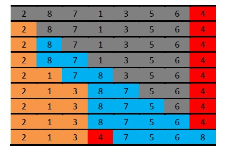

[TOC levels=1-4]: # " "

- [快速排序（Quick Sort）](#快速排序quick-sort)
    - [一、算法思想](#一算法思想)
    - [二、算法示意图](#二算法示意图)
    - [三、Java 代码](#三java-代码)
    - [四、算法复杂度](#四算法复杂度)


# 快速排序（Quick Sort）

## 一、算法思想

快速排序，顾名思义，效率比较于其他算法，效率比较高。《算法导论》也专门对其进行讲解。其算法设计使用分治思想，如下：

1. 从数组A[p...r]中选择一个元素，将数组划分成两个子数组：A[p...q-1]和A[q+1...r]，使得A[p...q-1]中的元素全部小于等于A(q)，使得A[q+1...r]中的元素全部大于A(q)
2. 通过递归调用快速排序，分别对A[p...q-1]和A[q+1...r]排序
3. 因为两个子数组是就地排序，因此它们的合并不需要操作，整个数组A[p...r]已经排序；

## 二、算法示意图


图中所示只是代表一次分的过程，其中红色的4代表选中的用于分割的数组元素，灰色部分代表待排序的过程，黄色部分代表小于等于选中元素的数组元素，蓝色部分则代表大于选中元素的数组元素。解释一下这一次过程的形成：

第一行表示待排序的数组，其中默认选择待排序数组的最后一个元素作为中间元素进行分割。第二行我们看第一个元素，2比4小，不需要操作，第三行看8,8比4大，也不需要操作，因为由图可以看出来，第三行正好是‘≤4’，‘>4’，待排序元素，选择元素这样一个序列；第四行看7，发现7>4，也不需要操作，第五行看1,1这个时候比4小，应该和2放在一起，则最快的方法是和‘>4’序列块的第一个元素交换，因此将滴4行元素的1和8交换就得到第五行；同理，第六行看的是3，将第五行的3和7交换就得到第六行。如此下去，直到倒数第二行，已经没有待排序元素了。这个时候，将交换元素和‘>4’序列块的第一个元素交换，即4和8交换，就形成最后一行，最终的形式是‘≤选中元素(4)’，选择元素，‘＞选中元素(4)’这样一个序列。然后再对‘≤选中元素(4)’和‘＞选中元素(4)’两个序列块，即最后一行的黄色部分和蓝色部分分别执行相同过程，最终完成排序。

从描述中可以看到：

1. 选择最后一个元素作为选择元素，可以最大程度降低元素交换的复杂性；
2. 如果遍历找到比选中元素小或者相等的元素，则需要和‘＞选中元素’序列块的第一个元素交换，这样就可以和‘≤选中元素’的序列块最快的接合到一起；
3. 如果遍历找到比选中元素大的元素，则不需要操作；
4. 为了快速的交换，我们需要对序列添加多个指针：指向‘≤选中元素’的序列块的第一个和最后一个，指向选中元素；

## 三、Java 代码
```java
//@wiki
public class Quicksort {
    public static final Random RND = new Random();
 
    private static void swap(Object[] array, int i, int j) {
        Object tmp = array[i];
        array[i] = array[j];
        array[j] = tmp;
    }
 
    private static <E> int partition(E[] array, int begin, int end, Comparator<? super E> cmp) {
        int index = begin + RND.nextInt(end - begin + 1);
        E pivot = array[index];
        swap(array, index, end);    
        for (int i = index = begin; i < end; ++ i) {
            if (cmp.compare(array[i], pivot) <= 0) {
                swap(array, index++, i);
            }
        }
        swap(array, index, end);    
        return (index);
    }
 
    private static <E> void qsort(E[] array, int begin, int end, Comparator<? super E> cmp) {
        if (end > begin) {
            int index = partition(array, begin, end, cmp);
            qsort(array, begin, index - 1, cmp);
            qsort(array, index + 1,  end,  cmp);
        }
    }
 
    public static <E> void sort(E[] array, Comparator<? super E> cmp) {
        qsort(array, 0, array.length - 1, cmp);
    }
 
}
```

这段代码应该比较好懂，因为和上面的解说基本一样，qsort函数是一个递归函数，其中用到一个partition函数进行分割。这段代码有以下几个需要注意的地方：

1. 使用了泛型和Comparator，这样更具扩展性；
2. 注意12~14行，前面解说中我们默认选择的是待排序序列的最后一个元素，但是这里不是，这里是随机产生一个选择元素，然后为了交换元素的方便，首先将这个选择元素交换到序列的最后面去，划归到解说中的形式；

## 四、算法复杂度

 最坏情况划分：在划分过程中产生两个区域，分别包含n-1个元素和1和0元素的时候（这个时候选中的元素是序列中最大或者最小的元素）。假设算法的每一次递归调用的时候都出现了这种不对称的划分，划分的时间代价为θ(n)。因为对一个大小为0的数组进行递归调用以后，返回T(0)=θ(1)，所以算法的运行时间可以递归的表示为:

        T(n) = T(n-1) + θ(n) + θ(1)
利用替换法，可以比较直接的证明其解为T(n)=θ(n^2)。

最好情况划分：即划分的时候，序列正好划分为两半，有时候序列元素个数为奇数，不能相等，则左右可以相差1，这个时候，其表达式为：

        T(n) ≤ 2T(n/2) + θ(n)

可以解得递归式的解为T(n)=O(nlogn)。
