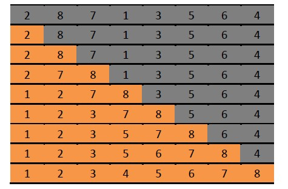

[TOC levels=1-4]: # " "

- [插入排序（Insertion Sort）](#插入排序insertion-sort)
    - [一、算法思想](#一算法思想)
    - [二、算法示意图](#二算法示意图)
    - [三、Java 代码](#三java-代码)
    - [四、算法复杂度](#四算法复杂度)


# 插入排序（Insertion Sort）

[http://www.cnblogs.com/lqminn/p/3649845.html](http://www.cnblogs.com/lqminn/p/3649845.html)


## 一、算法思想

一般来说，插入排序都采用in-place在数组上实现的。具体算法描述如下：

1. 从第一个元素开始，该元素可以认为已经被排序
2. 取出下一个元素，在已经排序的元素序列中从后向前扫描
3. 如果该元素（已排序）大于新元素，将该元素移到下一个位置
4. 重复步骤3，知道找到一排序的元素小于或者等于新元素的位置
5. 将新元素插入到该位置后
6. 重复步骤2~5

## 二、算法示意图



如图所示，阴影部分代表待排序的部分，黄色部分代表已经排序好的部分。排序过程就是讲阴影部分的第一个元素从后往前插入
到黄色的部分，同事不能破坏黄色部分的顺序。插入过程简述如下：

以第五行到第六行的变换为例，就是将3插入到黄色部分的过程。3先和8做比较，3<8，将8往后移动一格；然后3和7做比较，3<7，
将7往后移动一格；3和2比较，3>2，将3插入到7原来的位置。

## 三、Java 代码

```java
public class InsertionSort extends Sort{
    public static void sort(int[] array) {
        for (int index = 1; index < array.length; index++) {
            int key = array[index];
            int position = index;
            // shift larger values to the right
            while (position > 0 && array[position - 1] > key) {
                array[position] = array[position - 1];
                position--;
            }
            array[position] = key;
        }
    }
}
```


## 四、算法复杂度

插入排序的算法复杂度很好分析，假设array的长度为N，外层for循环一共要执行n-1-1即n-2次，内层的while循环，
最多执行index次，最少执行1次。因此其最坏的情况就是每次都执行index次，其算法复杂度是n*(n-1)/2，即O(n^2)，
此时数组的厨师状态是倒序排列的；最好的情况是n-1次，即O(n)，此时的数组的初始状态是顺序排列。平均时间复杂度是O(n^2)。

空间复杂度非常容易，由代码可以看出来，只需要一个位置key用于交换即可，因此是O(1)。

