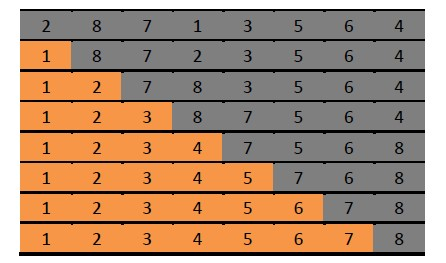

[TOC levels=1-4]: # " "

- [选择排序（Selection Sort）](#选择排序selection-sort)
    - [一、算法思想](#一算法思想)
    - [二、算法示意图](#二算法示意图)
    - [三、Java 代码](#三java-代码)
    - [四、算法复杂度](#四算法复杂度)


# 选择排序（Selection Sort）

## 一、算法思想
选择排序是一种简单直观的排序算法。它的工作原理如下：

1. 将序列分成两部分，前半部分是已经排序的序列，后半部分是未排序的序列；

2. 在未排序序列中找到最小（大）元素，放到已排序序列的末尾。以此类推，直到所有元素均排序完毕。

## 二、算法示意图

  

图中阴影部分是未排序的序列，黄色部分是排序好的序列。第一行是待排序的初始序列，最后一行是排好序的序列。

从第一行中选择出最小的元素1，将其和未排序序列的第一个元素交换，从而形成第二行。第二行从阴影部分找到最小的元素2，将2和阴影部分的第一个元素8交换，形成第三行。其实这个过程和冒泡排序非常相似，只是如何将下一个元素移动到排序序列的最末端的方式不一样。如此继续下去，就可以完成序列排序。

## 三、Java 代码
```java
//@wiki
public class SelectionSort extends Sort{
    public static void sort(int[] array) {
        int temp;
        int min;
        for (int index = 0; index < array.length - 1; index++) {
            min = index;
            for (int next = index + 1; next < array.length; next++) {
                if (array[next] < (array[min])) {
                    min = next;
                }
            }
            temp = array[index];
            array[index] = array[min];
            array[min] = temp;
        }
    }
}
```

## 四、算法复杂度

选择排序的算法复杂度很好分析，因为从代码来看，其算法复杂度与初始序列无关，假设初始序列元素的个数为n，则算法复杂度为O(n^2)，因为第10行会执行n*(n-1)/2。因此选择排序的最优/最差/平均时间复杂度都是O(n^2)。

空间复杂度非常容易，由代码可以看出来，只需要一个位置temp用于交换即可，因此是`O(1)`。